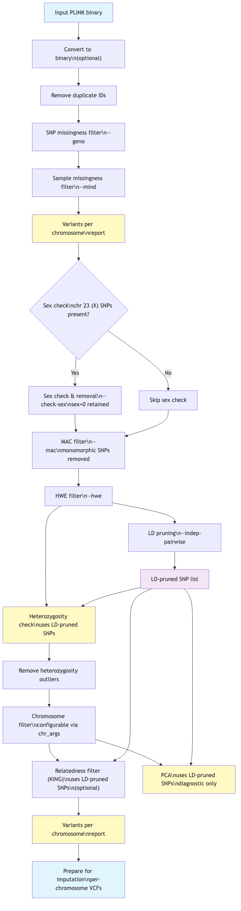
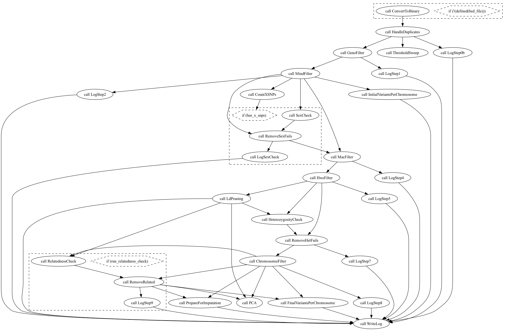

# Genotype QC Pre-Imputation Pipeline


## Overview

`src/genotype_qc_preimputation.wdl` is a WDL 1.0 workflow that performs
standard pre-imputation quality control on genotyping array data. It follows
the Anderson et al. (2010) protocol with ancestry-aware extensions, and
produces a clean PLINK binary dataset and per-chromosome VCFs ready for
submission to imputation servers (HRC, TOPMed).

The pipeline is run with Cromwell:

```bash
java -jar cromwell-92.jar run src/genotype_qc_preimputation.wdl \
     -i config/genotype_qc_preimputation_inputs.json
```

Results are collected with:

```bash
bash src/collect_cromwell_results.bash <cromwell-run-uuid-dir> ./results
```
<!--
This is commented out


-->



---

## Pipeline Steps

### Step 0 — Format conversion (optional)

If the input is in PLINK text format (ped/map), it is converted to binary
(bed/bim/fam). Skip this by supplying bed/bim/fam directly.

### Step 0b — Duplicate sample IDs

Duplicate IDs in the FAM file cause downstream PLINK errors. The R script
`handle_duplicates.R` appends a numeric suffix to make each ID unique and
writes a log of affected samples.

### Step 1 — SNP missingness filter (`--geno`)

Removes variants with a missing genotype rate above `geno_threshold`.
Run before sample filtering so that poorly genotyped SNPs do not inflate
per-sample missingness.

### Step 2 — Sample missingness filter (`--mind`)

Removes samples with a missing genotype rate above `mind_threshold`.

### Threshold sweep (informational)

Runs PLINK across a grid of geno/mind values (0.01, 0.02, 0.05, 0.10,
0.20) and plots variant and sample retention. Used to validate that the
chosen thresholds represent sensible trade-offs. No data are removed.

Output: `threshold_plot.png`

### Step 3 — Sex check

Infers sex from X-chromosome heterozygosity and compares it to the FAM
file. Samples where the reported and inferred sex disagree are removed.
Skipped automatically if the dataset has no X-chromosome SNPs. Samples
with sex code 0 ("unknown") are retained.

### Step 4 — Ancestry PCA

PCA is computed on the 1000 Genomes Phase 3 reference panel only, then
all study samples (including related pairs) are projected into that
reference PC space. This keeps the PC axes stable and independent of
study composition.

**Procedure:**

1. SNPs are matched between study and reference by rsID. A positional
   concordance check discards rsID-matched variants that sit at different
   chr:pos coordinates (catches genome-build mismatches).
2. If `pca_reference_populations` is not `"ALL"`, the reference panel is
   filtered to the listed superpopulations before PCA.
3. The filtered reference is LD-pruned.
4. PLINK2 `--pca biallelic-var-wts` computes `n_pcs` PCs on the reference
   and saves per-variant weights in `.eigenvec.var`.
5. Reference allele frequencies are saved (`--freq`) for use in step 6.
6. All study samples are projected with `--score … variance-standardize`.
   The raw `SCORE_AVG` values are rescaled to the eigenvec scale before
   classification: `eigenvec_k = SCORE_AVG_k × 2 / sqrt(eigenvalue_k)`.
7. A random forest (500 trees, `randomForest` R package) is trained on the
   reference eigenvec scores and their known superpopulation labels, then
   applied to all study samples. Each sample receives:
   - `superpop`: predicted superpopulation (`EUR`, `AFR`, `EAS`, `SAS`,
     `AMR`), or `"unassigned"` if the prediction probability is below
     `ancestry_prob_threshold`.
   - `probability`: maximum class probability from the random forest.

**Outputs:**

| File | Description |
|------|-------------|
| `*_ancestry_assignments.tsv` | FID, IID, superpop, probability |
| `*_ancestry_pca.png` | Grid of PC pair plots (PC1/2 … PC9/10), study samples coloured by predicted superpopulation |
| `*.eigenvec` | Reference-panel PC scores |
| `*.eigenvec.var` | Per-variant PC weights |
| `*.eigenval` | PC eigenvalues |
| `all_study_projected.sscore` | Raw projected scores for all study samples |

### Step 5 — MAC filter

Removes monomorphic variants and variants with minor allele count below
`mac_threshold`. Applied to the full cohort because rarity is a global
property of the dataset.

Output: `mac_plot.png`

### Step 6 — HWE filter

Hardy-Weinberg equilibrium is tested separately within each superpopulation
listed in `test_populations`. Variants failing HWE in any tested population
are removed from the entire cohort. Testing on a subset prevents false
violations caused by population stratification in admixed samples.

### Step 7a — LD pruning (helper)

Produces an independent SNP list using `ld_window_kb`, `ld_step`, and
`ld_r2`, with the high-LD regions in `ld_regions` excluded. Used only as
input to the heterozygosity check (step 7b) and the relatedness check
(step 9); the pruning is not applied to the final dataset.

### Step 7b — Heterozygosity outlier removal

Per-sample heterozygosity (F-statistic) is computed on LD-pruned variants.
Samples more than 3 SD from the mean within the tested ancestry subset are
flagged and removed — but only from that subset. The removed samples are
not propagated to the rest of the cohort, preserving samples from
populations not covered by `test_populations`.

### Step 8 — Chromosome filter

Restricts the dataset to the chromosomes listed in `chr_args`.

### Step 9 — Relatedness check (KING)

KING kinship coefficients are computed on the full post-QC dataset. Pairs
with kinship above `king_cutoff` are flagged. Samples are **not removed**
automatically. The output file lists one member of each related pair and
can be supplied to PLINK `--remove` in downstream association tests.

Output: `relatedness_flagged_samples.txt`

### Step 10 — Prepare for imputation

Will Rayner's `HRC-1000G-check-bim.pl` harmonises the dataset against the
HRC or TOPMed frequency reference: checks strand, ref/alt assignment, and
frequency concordance. Variants absent from the reference, ambiguous A/T
and C/G SNPs that cannot be strand-resolved, and variants whose allele
frequency diverges sharply from the reference are dropped.

Two things come out of this step:

- **Per-chromosome VCFs** (bgzipped and tabix-indexed) ready for
  submission to an imputation server.
- **A combined dataset** — the per-chromosome PLINK filesets merged back
  into a single `*_imputation_combined` bed/bim/fam. This is the PLINK
  equivalent of the VCFs: same harmonised, strand-corrected variant set.
  Steps 11–13 all build on it, *not* on the step 8 output.

Step 10a reports variant counts per chromosome on the combined file, so
the numbers match what was actually written to the VCFs.

#### Reading `check-bim.log`

Figures below are from the BCS70 test run — 517,552
variants entering step 10, 503,680 delivered — and are illustrative, not
thresholds.

**`Total checked`:** The number of variants that could actually be compared with the reference, 
i.e. the sum of `ID matches HRC` and `ID Doesn’t match HRC`.

**`Total Position Matches`:** The number of bim variants
found at a matching `chr-pos` in the reference, regardless of whether the
variant ID, the alleles or the strand agreed. HRC r1.1 catalogues ~39.2M sites at MAC ≥ 5 and
genotyping arrays target precisely these common, validated sites. For that reason, the proportion of matched sites is expected to be very high. The row is informative only when it is *low* — a
near-zero value means the array and the reference are on different genome
builds. `Position different from <ref>` counts variants whose rsID is present in the reference but at a different genomic position. Non-zero values usually indicate genome build mismatches, outdated rsIDs, merged or split dbSNP records, or incorrect variant annotation.

**`Non Matching alleles`:** The number of variants that were found at the same position in the reference but whose allele pair does not match the reference allele pair. This is usually a small number, and is often due to a manifest error or a systematic allele coding difference between the array and the reference. The script generates `Allele-<stem>-HRC.txt` so that PLINK can update the allele coding.

**`ID and allele mismatching`:** The number of variants that were found at the same position in the reference but whose alleles do not match and whose IDs also do not match. This is usually a small number, and is often due to a manifest error or a systematic allele coding difference between the array and the reference. The script writes `ID-Allele-<stem>-HRC.txt` to update both the variant ID and allele coding.

**`ID Doesn’t match HRC`:** A large count is usually cosmetic. On the BCS70 GSA
array, 240,605 of the 245,976 mismatches are IDs of the form
`GSA-rs4475691` — the correct rsID behind a manifest prefix. The script
writes `ID-<stem>-HRC.txt` to rename them; nothing is dropped.

**Strand and ref/alt changes**: 

The strand/ref-alt rows are really a 2×2:

|  | ref/alt already right | ref/alt swap needed |  |
|---|---|---|---|
| forward strand | 40,881 (`SNPs not changed`) | 213,641 | 254,522 (`Strand ok`) |
| reverse strand (needs flip) | 39,454 | 211,966 | 251,420 (`Strand to change`) |
| column total | 80,335 | 425,607 (`SNPs to change ref alt`) | 505,942 (`Total checked Strand`) |

`Total Strand ok` equals `SNPs not changed` + `SNPs to change ref alt`. It is therefore the number of variants already on the correct DNA strand, irrespective of whether their REF/ALT (A1/A2) ordering must be swapped.

A large `SNPs to change ref alt` is expected rather than a defect: In many PLINK workflows, A1 is not guaranteed to correspond to the reference genome REF allele. Since the HRC panel uses the genome REF/ALT alleles, many variants legitimately require a REF/ALT swap.In many PLINK workflows, A1 is not guaranteed to correspond to the reference genome REF allele. Since the HRC panel uses the genome REF/ALT alleles, many variants legitimately require a REF/ALT swap. Likewise, TOP/BOT coding frequently results in a substantial proportion of SNPs requiring strand flips after comparison with a forward-strand reference, but the exact fraction depends on the array and the export format. Around half is common, but not a universal expectation.

**`Total removed for allele Frequency diff`:** The number of variants that were removed because the allele frequency in the cohort differed from the reference by more than 0.2. This is a key QC metric: a large spike points to a genuine cohort/reference mismatch — an inappropriate ancestry reference, or systematic allele miscoding.


### Step 11 — PLINK 2 conversion

`--make-pgen` writes the combined dataset a second time in PLINK 2 format
(`pgen`/`pvar`/`psam`). Nothing is filtered; this is a format convenience
for tools that require PLINK 2 input (and for the `--glm` association
workflow in particular).

### Step 12 — Within-cohort covariate PCA

Principal components for use as association covariates. Unlike step 4,
which places samples against an external reference to infer ancestry,
this PCA describes structure *within* your own cohort.

The procedure avoids two common mistakes — letting relatives dominate the
axes, and dropping related samples from the output:

1. LD-prune the combined dataset, autosomes only, excluding `ld_regions`.
2. Compute allele frequencies on the **unrelated** samples (the step 9
   KING flags supply `--remove`).
3. Run `--pca n_covariate_pcs biallelic-var-wts` on those unrelated
   samples, saving variant weights.
4. Project **all** samples — related included — onto those axes with
   `--score`, standardised against the same frequencies.

Every participant therefore receives PCs on one common scale, and no
sample is lost. If no relatives were flagged, steps 2–4 degrade
gracefully to a plain PCA over everyone.

Output: `*_covariate_pca_covariates.tsv` (`FID IID PC1..PCn`) plus the
eigenvalues, for judging how many PCs to actually include as covariates.

### Sample QC status table

Not a filtering step — a join. Ancestry assignments (step 4), relatedness
flags (step 9) and covariate PCs (step 12) are merged into one row per
participant:

```
FID  IID  ancestry  ancestry_prob  related  PC1 … PCn
```

`related` is `TRUE`/`FALSE` rather than a pair list, so the file can be
filtered directly. This is the intended entry point for cohort
selection — pick your ancestry stratum, decide whether to drop relatives,
and read off covariates, all without touching the genotype files.

Output: `*_sample_qc_status.tsv`

### Step 13 — Unrelated single-ancestry subset

An additional deliverable for the common case of a single-population
association analysis. Samples are kept if they are **both** assigned to
`subset_population` (default `EUR`) **and** not flagged as related at step
9. Selection is by IID, which is safe because step 0b guarantees unique
IIDs.

The subset is exported as PLINK 1 (bed/bim/fam) *and* PLINK 2
(pgen/pvar/psam), and covariate PCs are **recomputed within the subset**.
That recomputation matters: whole-cohort PCs largely capture
between-ancestry differences, which carry no information once the cohort
has been restricted to one population. Within-subset PCs describe the
finer-grained structure that remains, and are the correct covariates for
a within-population test.

Because every sample here is already unrelated, this PCA has no relatives
to exclude and reduces to a straightforward PCA over the subset.

---

## Configuration

All parameters live in `config/genotype_qc_preimputation_inputs.json`.
Every key is prefixed with `genotype_qc_preimputation.`.

### Input files

| Parameter | Description |
|-----------|-------------|
| `bed_file`, `bim_file`, `fam_file` | PLINK binary input. Supply these **or** ped/map, not both. |
| `ped_file`, `map_file` | PLINK text input (converted to binary automatically). |
| `output_prefix` | String prefix for all output files (e.g. `"array_qc"`). |

### Reference files

| Parameter | Description |
|-----------|-------------|
| `ld_regions` | High-LD genomic regions excluded from LD pruning. Tab-separated, four columns: chr start end name (hg19). Download with `bash src/download_resources.bash`. |
| `ref_1kg_bed`, `ref_1kg_bim`, `ref_1kg_fam` | 1000 Genomes Phase 3 reference panel in PLINK binary format. Must be autosomal, biallelic SNPs only. |
| `ref_1kg_psam` | 1000G sample metadata file. Must contain a `SuperPop` column with values `EUR`, `AFR`, `EAS`, `SAS`, `AMR`. |
| `hrc_ref_freq` | HRC r1.1 GRCh37 allele frequency file (`.tab.gz`). Download with `bash src/download_resources.bash`. |


This script downloads a list of High-LD regions (hg19) and HRC reference panel frequency file for SNP ref/alt alignment:

```bash
# High-LD regions (hg19) and HRC frequency file
bash src/download_resources.bash
```
The 1000 Genomes Phase 3 reference panel is required for ancestry assignment. A biallelic-SNP-only, hg19, PLINK binary version of the 1000G Phase 3 panel can be obtained from https://www.cog-genomics.org/plink/2.0/resources#1kg_phase3. The companion .psam file contains a SuperPop column with values: EUR, AFR, EAS, SAS, AMR, that are needed for the ancestry assignment.


### Script paths

All scripts in `src/`. Set these to absolute paths.

| Parameter | Script |
|-----------|--------|
| `handle_duplicates_r` | `src/handle_duplicates.R` |
| `check_heterozygosity_r` | `src/check_heterozygosity_rate.R` |
| `heterozygosity_outliers_r` | `src/heterozygosity_outliers_list.R` |
| `ancestry_pca_plot_r` | `src/ancestry_pca_plot.R` |
| `mac_plot_r` | `src/mac_plot.R` |
| `threshold_plot_r` | `src/threshold_plot.R` |
| `create_qc_table_r` | `src/create_qc_status_table.R` |
| `check_bim_pl` | `src/HRC-1000G-check-bim.pl` |

### Tool paths

Default to bare command names (assumes tools are on `$PATH`). Override
with absolute paths if needed.

| Parameter | Tool | Minimum version |
|-----------|------|-----------------|
| `plink_bin` | PLINK 1.9 | 1.9 |
| `plink2_bin` | PLINK 2.0 | 2.0 |
| `rscript_bin` | R | 4.0 |
| `perl_bin` | Perl | 5.x |
| `bcftools_bin` | bcftools | — |
| `bgzip_bin` | bgzip | — |
| `tabix_bin` | tabix | — |

### QC thresholds

| Parameter | Default | Description |
|-----------|---------|-------------|
| `geno_threshold` | `0.03` | Maximum per-SNP missing rate (0–1). |
| `mind_threshold` | `0.05` | Maximum per-sample missing rate (0–1). |
| `hwe_pvalue` | `1e-6` | Minimum HWE p-value to retain a variant. |
| `mac_threshold` | `50` | Minimum minor allele count across the full cohort. |
| `pihat_min` | `0.2` | Minimum IBD coefficient for flagging related pairs. |
| `king_cutoff` | `0.0884` | KING kinship cutoff (~3rd-degree relative). |

### LD pruning parameters

The same three parameters are reused everywhere pruning happens: the
ancestry PCA (step 4, pruned on the reference panel), the shared helper
list for the heterozygosity and relatedness checks (step 7a, feeding steps
7b and 9), and the covariate PCAs (steps 12 and 13, pruned internally).

| Parameter | Default | Description |
|-----------|---------|-------------|
| `ld_window_kb` | `200` | Sliding window size in kilobases. |
| `ld_step` | `1` | Window step size in SNPs. |
| `ld_r2` | `0.1` | Maximum r² for a variant to be retained. |

### Ancestry PCA parameters

| Parameter | Default | Description |
|-----------|---------|-------------|
| `n_ancestry_pcs` | `10` | Number of principal components to compute and use for ancestry classification. |
| `pca_reference_populations` | `"ALL"` | Comma-separated list of 1000G superpopulations whose samples are included in the reference PCA. Possible values: any subset of `EUR,AFR,EAS,SAS,AMR`, or `"ALL"` to use all 2504 Phase 3 samples. Restricting to relevant populations can sharpen cluster separation for studies with limited ancestry diversity. |
| `ancestry_prob_threshold` | `0.5` | Random forest prediction probability below which a study sample is labelled `"unassigned"` rather than assigned to a superpopulation. Range 0–1; increase for stricter assignment. |


### Ancestry-aware filtering parameters

| Parameter | Default | Description |
|-----------|---------|-------------|
| `test_populations` | `"ALL"` | Comma-separated list of superpopulations on which HWE and heterozygosity detection are run (e.g. `"EUR"`, `"EUR,AFR"`). Use `"ALL"` to test the full cohort without stratification. Values must match the `superpop` column of the ancestry assignments file. |

### Imputation and chromosome parameters

| Parameter | Default | Description |
|-----------|---------|-------------|
| `chr_args` | `"--chr 1-23"` | PLINK chromosome filter applied at step 8. Use `"--chr 1-22"` for autosomes only or `"--autosome"` as an alternative. |

### Post-imputation-prep deliverables

| Parameter | Default | Description |
|-----------|---------|-------------|
| `n_covariate_pcs` | `20` | Number of within-cohort PCs computed at step 12 and recomputed within the subset at step 13. |
| `subset_population` | `"EUR"` | Superpopulation retained for the step 13 unrelated subset. Must be one of `EUR,AFR,EAS,SAS,AMR` and must appear in the ancestry assignments, or the subset will be empty. |

---

## Output structure

After running `bash src/collect_cromwell_results.bash <run-dir> ./results`:

```
results/
  *_pipeline.log       Per-step SNP/sample counts for the whole run
  qc_dataset/          Combined imputation-ready dataset (step 10 output,
                       harmonised): PLINK 1 bed/bim/fam + PLINK 2 pgen/pvar/psam
  vcfs/                chr1–23.vcf.gz + .tbi — imputation-ready VCFs
  pca/                 Ancestry PCA (eigenvec, eigenval, eigenvec.var, sscore,
                       prune.in, ancestry_assignments.tsv) and within-cohort
                       covariate PCs (*_covariates.tsv, eigenval)
  plots/               threshold_plot.png, mac_plot.png, het plots, ancestry_pca.png
  reports/             sex check, het outlier list, relatedness flags,
                       per-chr freq files, check-bim.log, ancestry
                       assignments, sample QC status table, per-chr variants
  subset/              Unrelated single-ancestry subset: keep list,
                       PLINK 1 bed/bim/fam, PLINK 2 pgen/pvar/psam,
                       within-subset *_covariates.tsv + eigenval
```

Note that `qc_dataset/` holds the **step 10 harmonised** dataset, not the
step 8 output. It is the PLINK counterpart of the VCFs, so genotype files
and VCFs describe the same variants. The step 8 dataset exists inside the
Cromwell run directory but is not collected.

**Key files:**

| File | Description |
|------|-------------|
| `reports/*_sample_qc_status.tsv` | **Start here.** One row per participant: FID, IID, ancestry, ancestry_prob, related, PC1..PCn. Subset the cohort and pull covariates from this one file. |
| `qc_dataset/*_combined.bed/bim/fam` | Harmonised genotypes, all chromosomes, PLINK 1. |
| `qc_dataset/*.pgen/pvar/psam` | The same data in PLINK 2 format. |
| `vcfs/chr*.vcf.gz` | Per-chromosome VCFs for imputation servers. |
| `pca/*_covariate_pca_covariates.tsv` | Whole-cohort covariate PCs (`FID IID PC1..PCn`), axes from unrelated samples, all samples projected. |
| `pca/ancestry_assignments.tsv` | Per-sample: FID, IID, superpop, probability. Use to select ancestry strata. |
| `reports/relatedness_flagged_samples.txt` | One member of each related pair. Pass to `plink --remove` in association tests if needed. |
| `subset/` | Ready-made unrelated `subset_population` cohort with its own within-subset covariate PCs. |

---

## QC report

`src/genotype_qc_report.qmd` generates a single self-contained HTML report from the 
Cromwell execution logs and output files.


```bash
quarto render src/genotype_qc_report.qmd \
    -P run_dir=/path/to/cromwell-executions/genotype_qc_preimputation/<uuid> \
    -P cohort="My cohort" \
    -P config_json=config/genotype_qc_preimputation_inputs.json \
    --output-dir /somewhere/outside/the/run/directory
```

| Parameter | Meaning |
|-----------|---------|
| `run_dir` | The Cromwell execution run dir, usually a uuid named directory. |
| `cohort` | Free-text cohort name shown in the report header. Optional. |
| `config_json` | The workflow inputs JSON, so the report can document the thresholds the run used. Optional. |
| `prefix` | Output prefix; the output_prefix parameter auto-detected from *_pipeline.log if omitted. Optional. |

It finds each file in the `call-<Task>/execution` directory that wrote it, using
the same task-to-output mapping as `collect_cromwell_results.bash`, and skips
the duplicate copies Cromwell keeps under `execution/glob-*/` and
`call-<Task>/inputs/`. On a retried task it reads the highest `attempt-N`.

Everything is read from the log, the report tables and file metadata — no
genotypes are parsed, so it renders in seconds. Files a run did not produce
(the sex check on an autosome-only array, for instance) are reported as absent
rather than breaking the render, and files are located by pattern rather than
by name so any `output_prefix` works.

Requires `quarto` plus the R packages in `environment.yml` (`knitr`,
`rmarkdown`, `tidyverse`; `jsonlite` only for the `config_json` table).

---

## Design notes

### Why reference-only PCA?

Computing PCA on the 1000G reference and projecting study samples keeps
the PC axes stable regardless of study size, population composition, or
the presence of related individuals. Related pairs would otherwise deflate
PC variance and distort ancestry clusters.

### Why SCORE_AVG needs rescaling

PLINK2 `--score` with `variance-standardize` outputs `SCORE_AVG =
SCORE_SUM / ALLELE_CT`, where `ALLELE_CT = 2 × (non-missing variants)`.
Because `SCORE_SUM` scales with the singular value of the genotype matrix
for each PC, the per-PC conversion is:

```
eigenvec_k = SCORE_AVG_k × 2 / sqrt(eigenvalue_k)
```

The `M_scored / M_pca` missingness factor cancels exactly in the division
by `ALLELE_CT`, so the formula is correct for any genotyping coverage.

### Ancestry-aware filtering strategy

| Filter | Applied to | Why |
|--------|-----------|-----|
| MAC | Full cohort | Rarity is a global property |
| HWE | Detected within `test_populations`, removed from full cohort | Avoids false violations from stratification in admixed samples |
| Heterozygosity | Detected and removed within `test_populations` only | Preserves samples from untested populations |
| Relatedness | Flagged on full cohort | User decides which samples to exclude |

---

## References

- Anderson CA et al. (2010) *Nat Protoc* 5:1564–1573. doi:10.1038/nprot.2010.116
- Chang CC et al. (2015) *GigaScience* 4:7. doi:10.1186/s13742-015-0047-8 (PLINK)
- Manichaikul A et al. (2010) *Bioinformatics* 26:2867–2873. doi:10.1093/bioinformatics/btq559 (KING)
- The 1000 Genomes Project Consortium (2015) *Nature* 526:68–74. doi:10.1038/nature15393
- Marees AT et al. (2018) *Int J Methods Psychiatr Res* 27:e1608. doi:10.1002/mpr.1608
